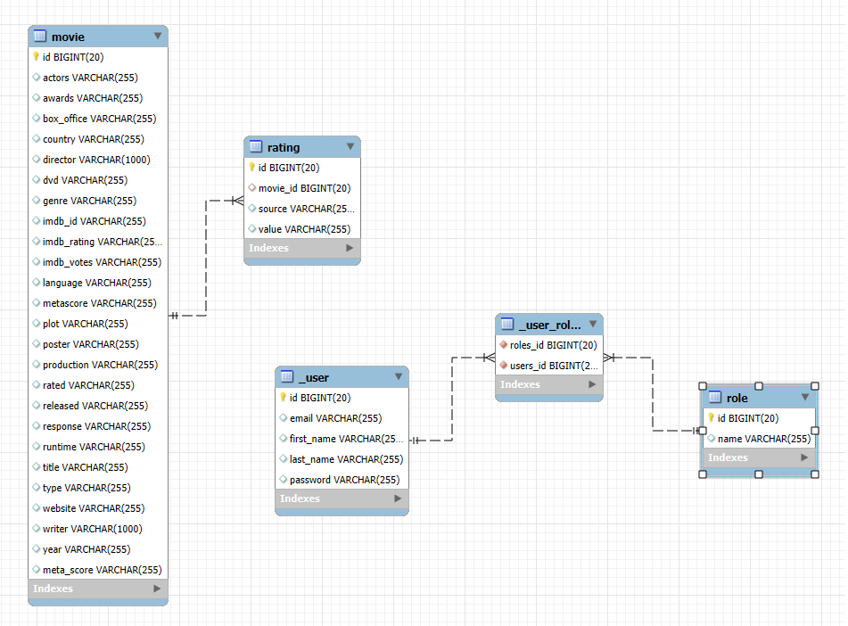
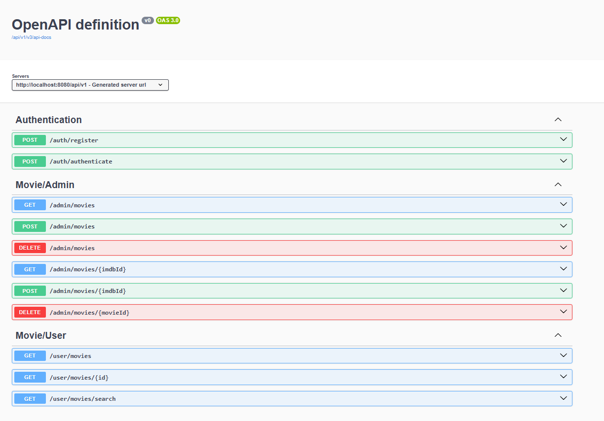

# Movie-Sphere

## Table of Contents

- [Overview](#overview)
- [Features](#features)
- [Technologies Used](#technologies-used)
    - [Backend (movie-sphere)](#backend-movie-sphere)
    - [Frontend (movie-sphere-ui)](#frontend-movie-sphere-ui)
- [Running the Project](#Running the Project)


## Overview

Movie Sphere is a full-stack application that allows users to explore and manage movie information. It provides a platform where users can browse movies, view detailed information, and search for specific movies. Additionally, it includes an Admin Dashboard that allows administrators to manage the movie database by adding or removing individual movies or groups of movies. The backend is built with Spring Boot 3 and Spring Security for secure access, while the frontend is developed using Angular and styled with Bootstrap.

## Features

- User Authentication: Users can securely log in to their accounts.
- Movie Browsing: Users can browse through a list of movies and view detailed information about each one, including IMDb ratings, actors, plot, genre, and more.
- Movie Details: By clicking on a movie, users are redirected to a page showing detailed information about the selected movie.
- Movie Search: A search bar allows users to quickly find a specific movie by its title or other attributes.
- Admin Dashboard: Administrators can manage the movie database, including:
- Add Movies: Admins can add individual movies or upload a collection of movies.
- Delete Movies: Admins can remove individual movies or delete multiple movies at once.
- Secure Access: The application ensures secure access using JWT tokens and Spring Security for user authentication and authorization.

#### Class Diagram


## Technologies Used

### Backend (movie-sphere)

- Spring Boot 3
- Spring Security 6
- JWT Token Authentication
- Spring Data JPA
- Spring Validation
- OpenAPI and Swagger UI Documentation
- Docker

## Swagger Docs


### Frontend (book-network-ui)

- Angular
- Component-Based Architecture
- Lazy Loading
- Authentication Guard
- OpenAPI Generator for Angular

## Running the Project

To run the **Movie-Sphere** project locally, follow these steps:

### Prerequisites

Before starting, ensure you have the following installed on your machine:

- **Docker**
- **Docker Compose**

### Steps to Run the Project

1. Clone the repository:
   ```bash
   git clone https://github.com/AmrElsebaey/movie-sphere.git
   cd movie-sphere


